<!-- markdownlint-disable MD033 MD041 -->
<div align="center">

# 🚀 Workflow Automation Platform

[](https://github.com/karnavpargi/workflow-automation/actions/workflows/ci.yml)
[](https://www.python.org/downloads/release/python-3120/)
[](https://www.djangoproject.com/)
[](https://github.com/psf/black)
[](https://github.com/astral-sh/ruff)
[](#license)

**A multi-tenant SaaS platform that automates back-office workflows for agencies and service businesses.**

[Getting Started](#-installation) · [Architecture](#-system-architecture) · [API Docs](#-api-documentation) · [Contributing](#-contributing-guide)

</div>

---
## 📑 Table of Contents

- [Project Overview](#-project-overview)
- [Screenshots / Demo](#-screenshots--demo)
- [Technology Stack](#-technology-stack)
- [System Architecture](#-system-architecture)
- [Folder Structure](#-folder-structure)
- [Installation](#-installation)
- [Environment Variables](#-environment-variables)
- [Configuration](#-configuration)
- [Running the Project](#-running-the-project)
- [Build Process](#-build-process)
- [Deployment Guide](#-deployment-guide)
- [API Documentation](#-api-documentation)
- [Authentication & Authorization](#-authentication--authorization)
- [Database](#-database)
- [Project Architecture](#-project-architecture)
- [Core Business Logic](#-core-business-logic)
- [Codebase Walkthrough](#-codebase-walkthrough)
- [Logging](#-logging)
- [Error Handling](#-error-handling)
- [Monitoring & Observability](#-monitoring--observability)
- [Performance Considerations](#-performance-considerations)
- [Security](#-security)
- [Testing](#-testing)
- [Linting & Formatting](#-linting--formatting)
- [CI/CD Pipeline](#-cicd-pipeline)
- [Docker](#-docker)
- [Troubleshooting](#-troubleshooting)
- [FAQ](#-faq)
- [Known Limitations](#-known-limitations)
- [Roadmap](#-roadmap)
- [Contributing Guide](#-contributing-guide)
- [Versioning Strategy](#-versioning-strategy)
- [Changelog](#-changelog)
- [License](#-license)
- [Glossary](#-glossary)
- [Mermaid Diagrams](#-mermaid-diagrams)

---
## 🎯 Project Overview

| | |
|---|---|
| **Name** | Workflow Automation Platform |
| **Version** | 0.1.0 |
| **Python** | ≥ 3.12 |
| **Framework** | Django 5.x + Django REST Framework |
| **Architecture** | Multi-tenant SaaS, event-driven, self-hosted |

### Purpose

A fully self-hosted, multi-tenant SaaS platform that automates repetitive back-office workflows for agencies and service businesses. It eliminates manual operations across client onboarding, follow-ups, invoicing, and data entry—sold both as an internal tool and as an external SaaS product.

### Problem It Solves

Agencies and service businesses waste significant hours on:
- Manual client onboarding steps (welcome emails, document collection, account setup)
- Follow-up reminders that fall through cracks
- Recurring invoice generation and delivery
- Manual data entry from emails, CSVs, and forms

This platform replaces those manual workflows with event-driven automation that fires reliably, retries on failure, and maintains a full audit trail.

### Key Features

- **Multi-tenancy with Row-Level Security** — Complete data isolation at the database level via PostgreSQL RLS policies
- **Event-driven workflow engine** — Domain events trigger Celery tasks with idempotency guarantees and exponential backoff retries
- **Client onboarding automation** — Configurable templates with welcome emails, document requests, and setup tasks
- **Integration adapter pattern** — Pluggable adapters for CRM, billing, storage, chat, and email (per-tenant configuration)
- **Append-only audit log** — Immutable compliance trail with DB-level enforcement (triggers block UPDATE/DELETE)
- **JWT authentication with RBAC** — Role-based access control (Admin, Member, Client) scoped per tenant
- **Self-hosted infrastructure** — Runs entirely on Docker Compose; no managed/PaaS dependencies

---
## 🖼️ Screenshots / Demo

> **Not Determined** — The React frontend is planned but not yet implemented. The current codebase exposes a REST API consumed by API clients.

---

## 🛠️ Technology Stack

| Layer | Technology | Purpose |
|-------|-----------|---------|
| Language | Python 3.12 | Backend services |
| Web Framework | Django 5.x | Application framework |
| API Framework | Django REST Framework 3.15+ | RESTful API layer |
| Authentication | `djangorestframework-simplejwt` 5.3+ | JWT token auth |
| Database | PostgreSQL 16 | Primary data store with RLS |
| Cache / Broker | Redis 7 | Celery message broker + result backend |
| Task Queue | Celery 5.4+ | Async workers + scheduled tasks |
| Object Storage | MinIO | S3-compatible file storage |
| Reverse Proxy | Caddy 2 | Auto-TLS, routing |
| HTTP Client | httpx 0.27+ | Integration adapter HTTP calls |
| Env Management | python-dotenv | Environment variable loading |
| Containerization | Docker + Docker Compose | Service orchestration |
| CRM | SuiteCRM (self-hosted) | Contact management |
| Billing | Invoice Ninja (self-hosted) | Invoice generation |
| Documents | Nextcloud (WebDAV) | Document storage |
| Chat | Mattermost (self-hosted) | Webhook notifications |

### Planned (Not Yet Implemented)

> All 11 plans are now shipped. The "free/OSS by default" stance holds
> across every layer — see [Free/OSS default path](#-freeoss-default-path)
> below for the smoke checklist.

### 🆓 Free/OSS default path

The full stack runs on free/OSS software with **zero paid API keys**:

| Layer | Free/OSS choice | Opt-in (paid) |
|---|---|---|
| LLM | Ollama (`llama3.1` / `qwen2.5`) | OpenAI (`AI_ENABLE_OPENAI=1`) |
| Embeddings | HuggingFace `BAAI/bge-small-en` (local) | OpenAI embeddings |
| Tracing | (off by default) | LangSmith free Developer tier |
| Vector DB | pgvector on Postgres | — |
| Chat | Mattermost (self-hosted) | — |
| Storage | MinIO (self-hosted) | — |
| Monitoring | Prometheus + Grafana OSS | — |
| Linting / Testing | ruff, black, pydocstyle, mypy, pytest, Vitest, Playwright | — |
| Frontend | React 18 + Vite 5 + React Router 6 + TanStack Query 5 | — |
| Load testing | Locust | — |
| PII redaction | Presidio (MIT) | — |

Bring up the optional observability profile with:

```bash
docker compose -f docker-compose.yml -f docker-compose.ops.yml up -d
```

Final smoke (all 11 plans green):

```bash
# Backend
pytest -q
# Frontend
cd frontend && npm test && npm run build
# Load smoke
locust -f ops/locust/locustfile.py -u 10 -r 2 -t 1m --headless
# Nightly eval
python ops/eval/run_nightly.py
```

---
## 🏗️ System Architecture

### High-Level Architecture

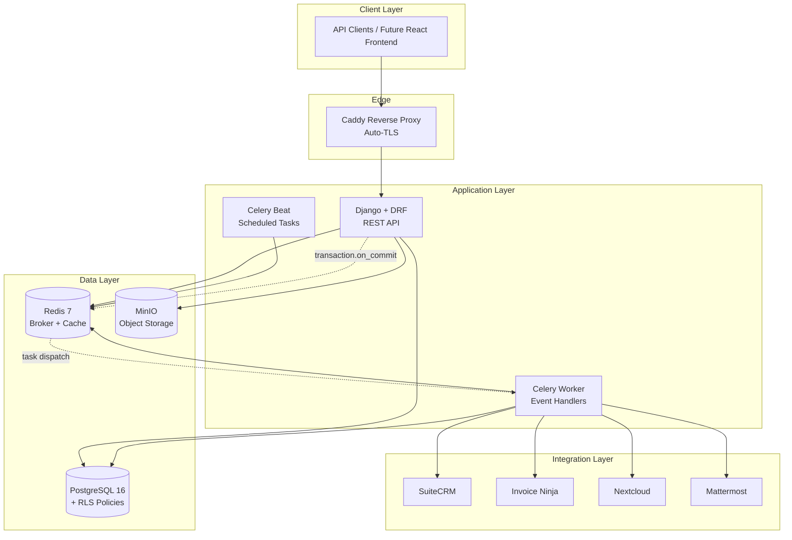
### Request Flow

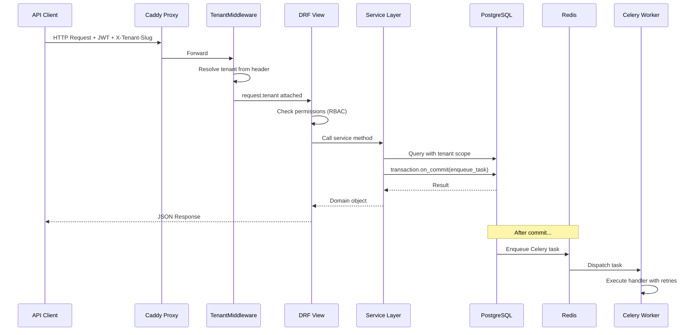

### Tenant Isolation via RLS

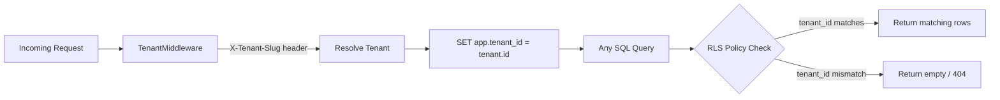

---
## 📁 Folder Structure

```
workflow-automation/
├── wa_main/                    # Django project root
│   ├── settings/
│   │   ├── base.py             # Shared settings (DB, auth, middleware, Celery)
│   │   ├── dev.py              # Local development overrides
│   │   └── test.py             # Test-specific settings (eager Celery)
│   ├── celery.py               # Celery application factory
│   ├── urls.py                 # Root URL routing
│   ├── asgi.py                 # ASGI entrypoint
│   └── wsgi.py                 # WSGI entrypoint
│
├── tenants/                    # Multi-tenancy core
│   ├── models.py               # Tenant + Membership models
│   ├── services.py             # create_tenant (public interface)
│   ├── middleware.py           # TenantMiddleware (X-Tenant-Slug → request.tenant)
│   └── rls.py                  # RLS helpers (enable/disable/set/reset)
│
├── users/                      # Authentication & RBAC
│   ├── models.py               # Custom User (email login)
│   ├── permissions.py          # IsTenantMember, IsTenantAdmin, IsClient
│   └── urls.py                 # JWT token endpoints
│
├── audit/                      # Compliance audit trail
│   ├── models.py               # AuditLog (append-only, trigger-protected)
│   ├── services.py             # log() — single entry point
│   └── migrations/             # Includes append-only trigger + RLS policy
│
├── workflows/                  # Event-driven workflow engine
│   ├── models.py               # Event + TaskRecord
│   ├── services.py             # emit_event, enqueue_task, mark_* lifecycle
│   ├── tasks.py                # run_handler Celery task (retries + dead-letter)
│   ├── registry.py             # Event name → handler mapping
│   └── exceptions.py           # RetryableError, PermanentError, HandlerNotFound
│
├── integrations/               # Vendor adapters (per-tenant config)
│   ├── base.py                 # Abstract interfaces + typed exceptions
│   ├── models.py               # IntegrationConfig (tenant, kind, credentials)
│   ├── services.py             # get_adapter() factory
│   ├── crm/suitecrm.py        # SuiteCRM REST adapter
│   ├── billing/invoice_ninja.py # Invoice Ninja REST adapter
│   ├── storage/minio_client.py # MinIO S3 adapter
│   ├── storage/nextcloud.py    # Nextcloud WebDAV adapter
│   ├── chat/mattermost.py     # Mattermost webhook adapter
│   └── email/django_smtp.py   # Django email backend adapter
│
├── onboarding/                 # Client onboarding automation
│   ├── models.py               # Client, OnboardingTemplate, Step, Run
│   ├── services.py             # create_client → emit client.created
│   ├── handlers.py             # start_onboarding (triggered by client.created)
│   ├── step_runners.py         # welcome_email, doc_request, setup_task
│   ├── views.py                # REST endpoints (list/create clients, status)
│   ├── serializers.py          # DRF serializers
│   └── urls.py                 # /api/clients/, /api/clients/<id>/onboarding/
│
├── tests/                      # Root-level cross-cutting tests
│   └── test_cross_tenant_isolation.py  # RLS contract test
│
├── docker/
│   └── postgres-init/
│       └── 01-nosuperuser.sql  # Downgrade wa role to NOSUPERUSER for RLS
│
├── docs/superpowers/           # Design specifications & feature plans
│   ├── specs/                  # Architecture design document
│   └── plans/                  # Per-feature implementation plans
│
├── .github/workflows/ci.yml   # GitHub Actions CI pipeline
├── docker-compose.yml          # Core stack (db, redis, web, worker, beat, caddy, minio)
├── docker-compose.integrations.yml  # Optional vendor stack for live tests
├── Dockerfile                  # Python 3.12 slim image
├── Caddyfile                   # Reverse proxy config
├── pyproject.toml              # Project metadata + all tool configs
├── manage.py                   # Django CLI entrypoint
├── conftest.py                 # Root pytest fixtures (RLS disable for tests)
└── .env.example                # Environment variable template
```

---
## 💻 Installation

### Prerequisites

| Requirement | Version | Notes |
|------------|---------|-------|
| Python | ≥ 3.12 | Required |
| PostgreSQL | 16+ | Or use Docker |
| Redis | 7+ | Or use Docker |
| Docker | 24+ | Recommended for full stack |
| Docker Compose | v2+ | Included with Docker Desktop |
| pip | Latest | Python package manager |

### Clone Repository

```bash
git clone https://github.com/karnavpargi/workflow-automation.git
cd workflow-automation
```

### Install Dependencies (Local Development)

```bash
# Create virtual environment
python3.12 -m venv .venv
source .venv/bin/activate

# Install with dev dependencies
pip install -e ".[dev]"
```

### Environment Setup

```bash
cp .env.example .env
# Edit .env with your local values (see Environment Variables section)
```

### Database Setup

```bash
# If running Postgres locally (without Docker):
createdb wa
psql -d wa -c "ALTER USER wa NOSUPERUSER;"  # Required for RLS

# Run migrations
python manage.py migrate

# Create superuser (optional, for Django admin)
python manage.py createsuperuser
```

---
## 🔐 Environment Variables

| Variable | Description | Required | Default | Example |
|----------|-------------|----------|---------|---------|
| `DJANGO_SECRET_KEY` | Django cryptographic signing key | ✅ | `dev-insecure-key` | `your-production-secret-key-here` |
| `DJANGO_ALLOWED_HOSTS` | Comma-separated allowed host headers | ✅ | `localhost` | `localhost,127.0.0.1,app.example.com` |
| `DB_NAME` | PostgreSQL database name | ✅ | `wa` | `wa` |
| `DB_USER` | PostgreSQL user | ✅ | `wa` | `wa` |
| `DB_PASSWORD` | PostgreSQL password | ✅ | `wa` | `strong-password-here` |
| `DB_HOST` | PostgreSQL host | ✅ | `localhost` | `db` (Docker) or `localhost` |
| `DB_PORT` | PostgreSQL port | ✅ | `5432` | `5432` |
| `CELERY_BROKER_URL` | Redis URL for Celery broker | ✅ | `redis://redis:6379/0` | `redis://localhost:6379/0` |
| `CELERY_RESULT_BACKEND` | Redis URL for Celery results | ✅ | `redis://redis:6379/1` | `redis://localhost:6379/1` |
| `MINIO_ROOT_USER` | MinIO access key (Docker only) | ❌ | `minio` | `minio` |
| `MINIO_ROOT_PASSWORD` | MinIO secret key (Docker only) | ❌ | `minio123` | `minio123` |

---

## ⚙️ Configuration

### Django Settings Modules

| Module | Usage |
|--------|-------|
| `wa_main.settings.base` | Shared settings (all environments). Reads env vars via `os.environ` + `python-dotenv`. |
| `wa_main.settings.dev` | Development: `DEBUG=True`, allows `localhost` hosts. |
| `wa_main.settings.test` | Testing: eager Celery (`TASK_ALWAYS_EAGER=True`), separate `wa_test` DB. |

### Key Configuration Points

- **JWT Tokens**: Access token lifetime 15 minutes, refresh token 1 day. Rotate + blacklist on refresh.
- **Celery**: Eager mode disabled in production; uses Redis broker at db 0, results at db 1.
- **Middleware**: `TenantMiddleware` is the last middleware in the chain—runs after auth.
- **INSTALLED_APPS**: `tenants`, `users`, `audit`, `workflows`, `integrations`, `onboarding` + Django/DRF defaults.

---
## ▶️ Running the Project

### Docker Compose (Recommended)

```bash
# Start the full stack (Postgres, Redis, Web, Worker, Beat, Caddy, MinIO)
docker compose up -d

# View logs
docker compose logs -f web
docker compose logs -f worker

# Run migrations inside the container
docker compose exec web python manage.py migrate

# Stop all services
docker compose down
```

### Local Development (Without Docker)

```bash
# Requires local Postgres and Redis running

# Terminal 1: Django dev server
export DJANGO_SETTINGS_MODULE=wa_main.settings.dev
python manage.py runserver

# Terminal 2: Celery worker
celery -A wa_main worker -l info

# Terminal 3: Celery Beat (scheduled tasks)
celery -A wa_main beat -l info
```

### With Integration Vendors (Live Testing)

```bash
# Start core stack
docker compose up -d

# Start optional vendor services (SuiteCRM, Invoice Ninja, Nextcloud, Mattermost)
docker compose -f docker-compose.integrations.yml up -d

# Run live adapter tests
MAKE_REAL=1 pytest integrations/tests/ -m live
```

---

## 🔨 Build Process

The project uses `setuptools` as its build backend with `pyproject.toml` for all configuration.

```bash
# Install in editable mode (development)
pip install -e ".[dev]"

# Build distribution
pip install build
python -m build

# Docker image build
docker build -t workflow-automation .
```

---
## 🚢 Deployment Guide

### Local (Docker Compose)

See [Running the Project](#️-running-the-project) above.

### Production (Single VM)

The platform is designed to run fully self-hosted on a single VM via Docker Compose, horizontally scalable later.

1. **Provision a VM** with Docker + Docker Compose installed.
2. **Configure DNS** to point your domain to the VM's IP.
3. **Update Caddyfile** with your domain:
   ```
   yourdomain.com {
       reverse_proxy web:8000
   }
   ```
4. **Set production environment variables** in `.env`:
   - Generate a strong `DJANGO_SECRET_KEY`
   - Set `DJANGO_ALLOWED_HOSTS` to your domain
   - Use strong DB/Redis passwords
5. **Deploy**:
   ```bash
   docker compose up -d
   docker compose exec web python manage.py migrate
   docker compose exec web python manage.py collectstatic --noinput
   ```

Caddy automatically provisions TLS certificates via Let's Encrypt.

### Staging

> **Not Determined** — No staging-specific configuration exists yet. Recommended approach: use a separate Docker Compose override file with staging-specific env vars.

### Kubernetes

> **Not Determined** — No Kubernetes manifests exist. The architecture is designed for future horizontal scaling but currently targets single-VM Docker Compose.

---
## 📡 API Documentation

All API endpoints require JWT authentication (except token obtain). Tenant-scoped endpoints require the `X-Tenant-Slug` header.

### Authentication Endpoints

#### Obtain Token Pair

```
POST /api/auth/token/
```

| Parameter | Type | Required | Description |
|-----------|------|----------|-------------|
| `email` | string | ✅ | User email |
| `password` | string | ✅ | User password |

**Request:**
```json
{
  "email": "user@example.com",
  "password": "secretpass"
}
```

**Response (200):**
```json
{
  "access": "eyJ0eXAiOiJKV1Qi...",
  "refresh": "eyJ0eXAiOiJKV1Qi..."
}
```

**Error (401):**
```json
{
  "detail": "No active account found with the given credentials"
}
```

---

#### Refresh Token

```
POST /api/auth/refresh/
```

| Parameter | Type | Required | Description |
|-----------|------|----------|-------------|
| `refresh` | string | ✅ | Refresh token |

**Request:**
```json
{
  "refresh": "eyJ0eXAiOiJKV1Qi..."
}
```

**Response (200):**
```json
{
  "access": "eyJ0eXAiOiJKV1Qi...",
  "refresh": "eyJ0eXAiOiJKV1Qi..."
}
```

---

#### Verify Token

```
POST /api/auth/verify/
```

| Parameter | Type | Required | Description |
|-----------|------|----------|-------------|
| `token` | string | ✅ | Access or refresh token |

**Response (200):** `{}` (empty body = valid)

**Error (401):**
```json
{
  "detail": "Token is invalid or expired",
  "code": "token_not_valid"
}
```

---

### Onboarding Endpoints

> All require `Authorization: Bearer <access_token>` and `X-Tenant-Slug: <slug>` headers.

#### List / Create Clients

```
GET /api/clients/
POST /api/clients/
```

**Permission:** `IsTenantMember`

**POST Request:**
```json
{
  "name": "Acme Corp",
  "email": "contact@acme.com"
}
```

**POST Response (201):**
```json
{
  "id": 1,
  "name": "Acme Corp",
  "email": "contact@acme.com",
  "created_at": "2026-07-19T10:30:00Z"
}
```

**GET Response (200):**
```json
[
  {
    "id": 1,
    "name": "Acme Corp",
    "email": "contact@acme.com",
    "created_at": "2026-07-19T10:30:00Z"
  }
]
```

---

#### Get Client Onboarding Status

```
GET /api/clients/{id}/onboarding/
```

**Permission:** `IsTenantMember`

**Response (200):**
```json
{
  "client": {
    "id": 1,
    "name": "Acme Corp",
    "email": "contact@acme.com",
    "created_at": "2026-07-19T10:30:00Z"
  },
  "runs": [
    {
      "id": 1,
      "client": 1,
      "template": 1,
      "template_name": "Default Onboarding",
      "status": "running",
      "created_at": "2026-07-19T10:30:05Z",
      "steps": [
        {"id": 1, "kind": "welcome_email", "order": 1, "config": {}, "delay_seconds": 0},
        {"id": 2, "kind": "doc_request", "order": 2, "config": {}, "delay_seconds": 300},
        {"id": 3, "kind": "setup_task", "order": 3, "config": {}, "delay_seconds": 600}
      ]
    }
  ]
}
```

**Error (404):** Client not found in current tenant.

### Common Error Responses

| Status | Meaning |
|--------|---------|
| 401 | Missing or invalid JWT token |
| 403 | Authenticated but insufficient permissions |
| 404 | Resource not found (or cross-tenant access blocked) |
| 422 | Validation error |

---
## 🔑 Authentication & Authorization

### Authentication Flow

1. Client sends `POST /api/auth/token/` with email + password
2. Server returns access token (15 min) + refresh token (1 day)
3. Client includes `Authorization: Bearer <access_token>` on subsequent requests
4. On expiry, client uses `POST /api/auth/refresh/` to rotate tokens
5. Old refresh tokens are blacklisted after rotation

### Authorization (RBAC)

| Permission Class | Who | Access Level |
|-----------------|-----|--------------|
| `IsTenantMember` | Any user with a membership on the current tenant | Read/write tenant-scoped resources |
| `IsTenantAdmin` | Users with `ADMIN` role on the current tenant | Administrative operations |
| `IsClient` | Any authenticated user | Client-portal access (scoping is view-level) |

### Tenant Resolution

- The `TenantMiddleware` reads the `X-Tenant-Slug` HTTP header on every request
- Missing header → `request.tenant = None` (tenant-scoped endpoints reject)
- Unknown/inactive slug → HTTP 404 (`"unknown tenant"`)
- Valid slug → `request.tenant` is set; views filter querysets by `tenant=request.tenant`

---
## 🗄️ Database

### Schema Overview

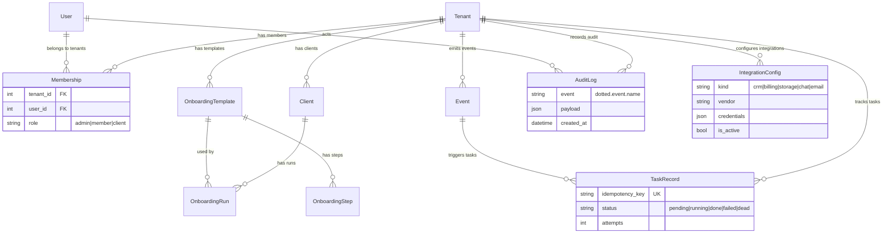

### Row-Level Security

Every tenant-scoped table has a PostgreSQL RLS policy:

```sql
CREATE POLICY tenant_isolation ON <table>
    USING (tenant_id::text = current_setting('app.tenant_id', true));
```

**RLS-protected tables:**
- `tenants_tenant`
- `audit_auditlog`
- `workflows_event`
- `workflows_taskrecord`
- `onboarding_client`
- `onboarding_onboardingtemplate`
- `onboarding_onboardingrun`

The application role (`wa`) is `NOSUPERUSER` + `FORCE ROW LEVEL SECURITY` so policies always apply, even to the table owner.

### Migrations

```bash
# Create new migrations
python manage.py makemigrations

# Apply migrations
python manage.py migrate

# Show migration status
python manage.py showmigrations
```

Notable migrations:
- `audit/0002_append_only.py` — Installs DB trigger blocking UPDATE/DELETE on `audit_auditlog`
- `audit/0003_audit_rls.py` — Enables RLS + `tenant_isolation` policy on `audit_auditlog`

### Seed Data

> **Not Determined** — No seed data scripts or fixtures are currently provided. Use Django admin or the API to create initial tenants and users.

---
## 🧩 Project Architecture

### Design Patterns

| Pattern | Where | Why |
|---------|-------|-----|
| **Service Layer** | `*/services.py` | Business logic is isolated from HTTP and ORM. Views are thin; inter-app calls go through services, never `Model.objects`. |
| **Adapter Pattern** | `integrations/` | Vendor-specific HTTP details are hidden behind abstract interfaces. Swapping vendors per tenant is a config change. |
| **Event-Driven** | `workflows/` | Domain events (e.g. `client.created`) decouple producers from consumers. New automations = register a new handler. |
| **Idempotency Key** | `workflows/services.py` | `task_name + entity_id + step` prevents duplicate task execution on retry/replay. |
| **Registry** | `workflows/registry.py` | Handlers register themselves at import time; the engine dispatches by event name without coupling to specific apps. |
| **Row-Level Security** | `tenants/rls.py` | Database-enforced tenant isolation—even bugs in app code cannot leak data. |
| **Append-Only Log** | `audit/` | DB trigger prevents mutation; compliance-ready audit trail. |
| **Factory** | `integrations/services.py` | `get_adapter(tenant, kind, vendor)` builds the correct adapter from config. |

### Layering Convention (Enforced Across All Apps)

```
┌─────────────────────────────┐
│  views.py / serializers.py  │  ← Thin HTTP wrappers
├─────────────────────────────┤
│  services.py                │  ← Business logic; public interface
├─────────────────────────────┤
│  models.py                  │  ← Data shape only; no business logic
└─────────────────────────────┘
```

- **Rule:** Other apps MUST call `app.services.function()`, never `app.Model.objects.*` directly.
- **Exception:** Read-only querysets in views for listing/filtering are acceptable.

### Module Dependency Flow

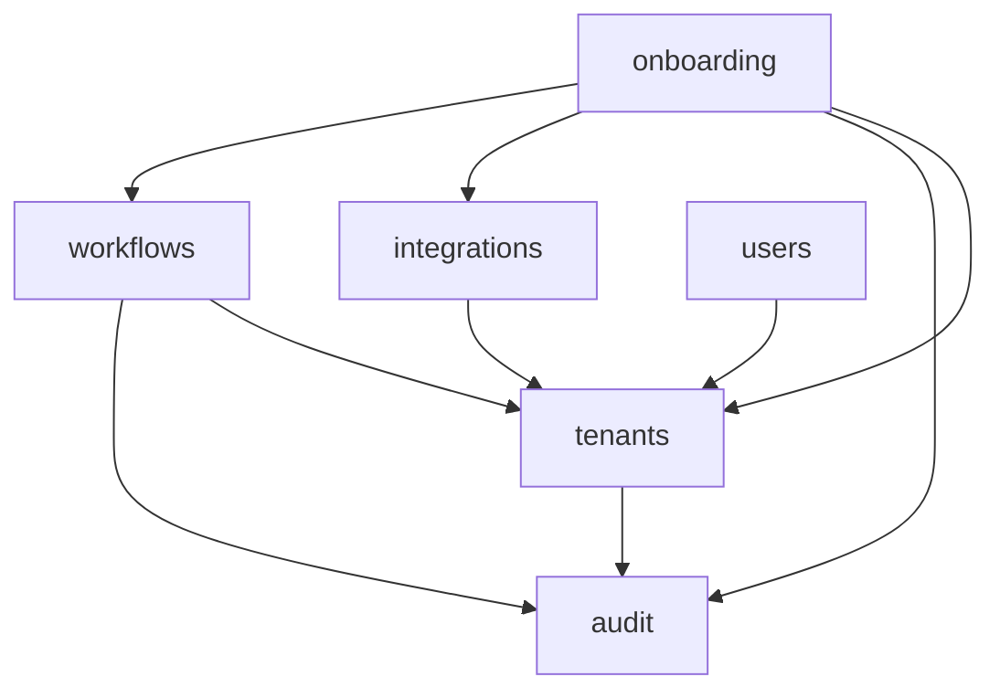

---
## ⚡ Core Business Logic

### Workflow 1: Client Onboarding (Fully Automated)

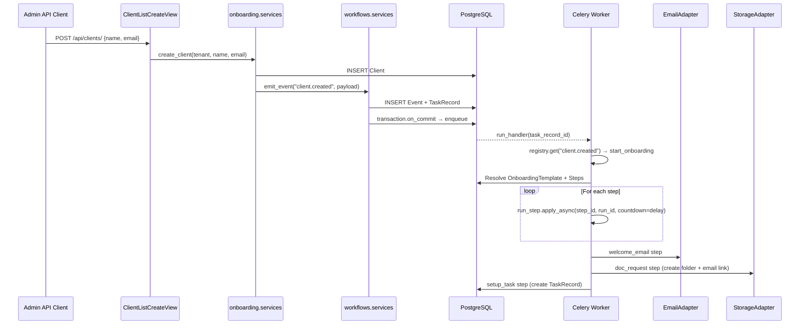

**Step kinds:**
| Kind | Action |
|------|--------|
| `welcome_email` | Sends welcome email via tenant's configured EmailAdapter |
| `doc_request` | Creates Nextcloud folder + emails upload link to client |
| `setup_task` | Creates an internal TaskRecord for staff follow-up |

### Workflow 2: Event → Task Execution with Retries

1. `services.emit_event()` persists an `Event` and creates a `TaskRecord` with an idempotency key
2. `transaction.on_commit` enqueues `run_handler` in Celery (never inside the transaction)
3. `run_handler` looks up the registered handler via `registry.get(event.name)`
4. On success → `mark_done()`
5. On `PermanentError` → `mark_dead()` immediately (no retries)
6. On any other exception → `mark_failed()` → retry with backoff:
   - Attempt 1: 60s delay
   - Attempt 2: 5 min delay
   - Attempt 3: 30 min delay
   - After all retries: `mark_dead()` + audit log entry `workflow.task.dead`

### Workflow 3: Tenant Creation

```python
tenants.services.create_tenant(name="Agency X", slug="agency-x", admin=user)
```
1. Checks slug uniqueness (raises `TenantSlugTaken` if duplicate)
2. Atomically creates Tenant + Membership (role=ADMIN) for the founding user
3. Writes audit log entry `tenant.created`

---
## 🗺️ Codebase Walkthrough

### For New Developers

1. **Start with the design spec:** `docs/superpowers/specs/2026-07-18-workflow-automation-design.md` — this is the single source of truth for architecture decisions.

2. **Understand tenant resolution:** Read `tenants/middleware.py` (20 lines) → understand that every request gets `request.tenant` attached from the `X-Tenant-Slug` header.

3. **Understand the service layer:** Read `tenants/services.py` and `onboarding/services.py` — these demonstrate the pattern. Business logic lives here, not in views or models.

4. **Trace a full workflow:** Follow `POST /api/clients/` through:
   - `onboarding/views.py` → `onboarding/services.py:create_client()`
   - → `workflows/services.py:emit_event()`
   - → `workflows/tasks.py:run_handler()`
   - → `onboarding/handlers.py:start_onboarding()`
   - → `onboarding/step_runners.py`

5. **Understand RLS:** Read `tenants/rls.py` (70 lines) and `docker/postgres-init/01-nosuperuser.sql` (1 line) — these are the foundation of data isolation.

6. **Run the tests:** `pytest -v` with local Postgres running (or via Docker).

### Key Invariants to Know

- Never import models from another app directly for writes — use `services.py`
- Never enqueue Celery tasks inside a DB transaction — always use `transaction.on_commit`
- Every tenant-scoped table needs RLS enabled (see [Adding a New Tenant-Scoped Table](#adding-a-new-tenant-scoped-table))
- Audit log is append-only at the DB level — the trigger will reject UPDATE/DELETE

---

## 📝 Logging

The project uses Python's standard `logging` module via Django's logging configuration.

- **Step runners** log at WARNING level when integration configs are missing
- **Workflow tasks** log at EXCEPTION level for permanently failed tasks
- **Registry** raises `HandlerNotFound` (caught by task runner and logged)
- **Adapters** raise typed exceptions that are caught and logged by callers

```python
import logging
logger = logging.getLogger(__name__)
```

> **Not Determined** — No custom logging configuration (formatters, handlers, log levels) is defined beyond Django defaults. Production deployments should configure structured logging.

---
## 🚨 Error Handling

### Error Classification

| Category | HTTP Status | Retry? | Example |
|----------|-------------|--------|---------|
| Validation | 400 | No | Invalid email format in client creation |
| Authentication | 401 | No | Expired or missing JWT |
| Authorization | 403 | No | User not a tenant member |
| Not Found | 404 | No | Cross-tenant access (RLS blocks), unknown slug |
| Retryable Integration | N/A (async) | Yes | `IntegrationUnavailable`, `IntegrationRateLimited` |
| Permanent Integration | N/A (async) | No | `IntegrationAuthFailed` |
| Permanent Workflow | N/A (async) | No | `PermanentError` → task goes to DEAD |
| Transient Workflow | N/A (async) | Yes | Any unhandled exception → retry with backoff |

### Integration Exceptions (Typed)

```python
class IntegrationUnavailable(Exception):   # Vendor down; retryable
class IntegrationAuthFailed(Exception):    # Bad credentials; not retryable
class IntegrationRateLimited(Exception):   # Rate limit; retryable with backoff
```

### Task Dead-Letter

When a task exhausts all retries (4 total attempts):
1. `TaskRecord.status` → `DEAD`
2. `TaskRecord.last_error` stores the final error message
3. Audit log entry created: `workflow.task.dead`
4. (Planned) Mattermost alert notification

---

## 📊 Monitoring & Observability

> **Not Determined** — No dedicated monitoring stack (Prometheus, Grafana, Sentry) is configured yet.

**Current observability:**
- Celery worker logs (stdout)
- Django request logs (stdout)
- Audit log table (queryable history of all significant events)
- TaskRecord table (workflow execution status and error history)
- MinIO console (port 9001) for object storage inspection

**Planned:**
- LangSmith for AI agent tracing (when AI service is implemented)
- Mattermost alerts for dead-letter tasks
- Locust load testing

---

## ⚡ Performance Considerations

- **Idempotency keys** prevent duplicate task execution on Celery retry storms
- **`transaction.on_commit`** ensures tasks are only enqueued after successful DB commit
- **Atomic `F()` increment** for `OnboardingRun.completed_steps` prevents lost updates from concurrent step completions
- **`select_related` / `prefetch_related`** used in views to minimize N+1 queries
- **RLS policies** use indexed `tenant_id` column for efficient filtering
- **Redis** as both broker and result backend minimizes infrastructure
- **Presigned URLs** for MinIO avoid proxying file downloads through the app server

---
## 🔒 Security

### Multi-Tenancy Isolation

| Layer | Mechanism |
|-------|-----------|
| Database | PostgreSQL Row-Level Security policies on every tenant-scoped table |
| Application | `TenantMiddleware` resolves tenant per request; views filter by `request.tenant` |
| Role | `NOSUPERUSER` DB role + `FORCE ROW LEVEL SECURITY` ensures policies always apply |
| API | Cross-tenant access returns 404 (no data leakage) |

### Authentication Security

- JWT access tokens expire in 15 minutes (short-lived)
- Refresh tokens rotated on every use; old tokens blacklisted
- `djangorestframework-simplejwt` handles token signing and validation
- Password hashing via Django's default (PBKDF2)

### Secrets Management

- All secrets stored in environment variables (never in code)
- `.env.example` provides the template; `.env` is gitignored
- Integration credentials stored per-tenant in `IntegrationConfig.credentials` (JSON)
- **Future:** At-rest encryption for credential blobs

### Input Validation

- DRF serializers validate all API input (type checking, required fields)
- Django ORM parameterized queries prevent SQL injection
- `EmailField` validates email format

### OWASP Considerations

| Risk | Mitigation |
|------|-----------|
| SQL Injection | Django ORM parameterized queries; raw SQL only in RLS helpers with `%s` params |
| Broken Auth | Short-lived JWTs + refresh rotation + blacklisting |
| Sensitive Data Exposure | RLS prevents cross-tenant data access at DB level |
| CSRF | DRF uses JWT (not session cookies); CSRF middleware still enabled for admin |
| IDOR | All queries scoped by `request.tenant`; IDs alone cannot access cross-tenant data |

---
## 🧪 Testing

### Test Structure

```
tests/                         # Cross-cutting contract tests
├── test_cross_tenant_isolation.py   # RLS enforcement verification
audit/tests/
├── test_services.py           # Audit log service tests
onboarding/tests/
├── test_api.py                # API endpoint tests
├── test_cross_tenant_isolation.py   # Onboarding RLS tests
├── test_flow.py               # End-to-end onboarding flow
├── test_models.py             # Model constraint tests
└── test_services.py           # Service layer tests
```

### Running Tests

```bash
# Run all tests
pytest -v

# Run a specific test file
pytest onboarding/tests/test_services.py -v

# Run a specific test by name
pytest -k "test_rls_blocks" -v

# Run with real vendor services (requires integration stack)
MAKE_REAL=1 pytest integrations/tests/ -m live
```

### Test Configuration

- **Settings:** `wa_main.settings.test` (set via `pyproject.toml`)
- **Celery:** `TASK_ALWAYS_EAGER=True` — tasks execute synchronously in tests
- **Database:** Separate `wa_test` database; pytest-django manages creation/teardown
- **RLS:** Disabled session-wide via `conftest.py` fixture; re-enabled only in RLS-specific tests
- **Markers:** `@pytest.mark.django_db(transaction=True)` required for RLS tests (DDL needs real transactions)

### Test Frameworks

| Tool | Purpose |
|------|---------|
| `pytest` 8.x | Test runner |
| `pytest-django` 4.8+ | Django integration (fixtures, DB management) |
| `respx` 0.21+ | Mock `httpx` requests for integration adapter tests |

### Coverage

> **Not Determined** — No coverage tool (`pytest-cov`) is configured. Target is ≥85% on `services.py` layers per design spec.

---
## 🧹 Linting & Formatting

All tools are configured in `pyproject.toml`. Run in this order (matches CI):

```bash
# 1. Lint (style + import order + bug detection)
ruff check .

# 2. Format check
black --check .

# 3. Docstring enforcement (Google style)
pydocstyle

# 4. Type checking (strict)
mypy tenants users audit
```

### Tool Configuration Summary

| Tool | Config | Scope | Notes |
|------|--------|-------|-------|
| `ruff` | `pyproject.toml` | All Python (excludes `migrations/`) | Rules: E, F, W, I, B, UP, SIM, C4. Line length 88. |
| `black` | `pyproject.toml` | All Python (excludes `migrations/`) | Line length 88. Target py312. |
| `pydocstyle` | `pyproject.toml` | `tenants`, `users`, `audit`, `wa_main` only | Google convention. |
| `mypy` | `pyproject.toml` | `tenants`, `users`, `audit` only | Strict mode. Django + DRF stubs. |

### Auto-fix

```bash
# Fix lint issues automatically
ruff check . --fix

# Format in place
black .
```

---
## 🔄 CI/CD Pipeline

### GitHub Actions (`.github/workflows/ci.yml`)

Triggered on: Pull requests + pushes to `main`.

```mermaid
graph LR
    A[Checkout] --> B[Setup Python 3.12]
    B --> C[pip install -e '.[dev]']
    C --> D[ruff check .]
    D --> E[black --check .]
    E --> F[pydocstyle]
    F --> G[mypy tenants users audit]
    G --> H[Configure non-superuser DB role]
    H --> I[python manage.py migrate]
    I --> J[pytest -v]
```

**Services provisioned in CI:**
- PostgreSQL 16 Alpine (with health check)
- Redis 7 Alpine

**Database role setup:**
CI creates a `wa_app` role with `NOSUPERUSER NOCREATEROLE NOBYPASSRLS` to match production RLS behavior. The default `wa` user (superuser in CI) is only used for initial setup.

**All checks must pass before merge.**

---
## 🐳 Docker

### Dockerfile

```dockerfile
FROM python:3.12-slim
# Installs build-essential, libpq-dev, curl
# Copies pyproject.toml → pip install → copies source
# Exposes port 8000
# CMD: python manage.py runserver 0.0.0.0:8000
```

- **Base image:** Python 3.12 slim (minimal footprint)
- **Multi-stage:** Not used (single stage; production could benefit from a multi-stage build)
- **Dev dependencies:** Included via `pip install -e ".[dev]"` (strip in production)

### Docker Compose Services

#### Core Stack (`docker-compose.yml`)

| Service | Image | Ports | Purpose |
|---------|-------|-------|---------|
| `db` | `postgres:16-alpine` | 5432 | Primary database with health check |
| `redis` | `redis:7-alpine` | 6379 | Celery broker + result backend |
| `web` | Built from `Dockerfile` | 8000 | Django dev server |
| `worker` | Built from `Dockerfile` | — | Celery worker |
| `beat` | Built from `Dockerfile` | — | Celery Beat scheduler |
| `caddy` | `caddy:2-alpine` | 80, 443 | Reverse proxy with auto-TLS |
| `minio` | `minio/minio:latest` | 9000, 9001 | S3-compatible object storage |

#### Integration Stack (`docker-compose.integrations.yml`)

| Service | Image | Ports | Purpose |
|---------|-------|-------|---------|
| `suitecrm` | `bitnami/suitecrm:latest` | 8081 | CRM integration testing |
| `invoiceninja` | `invoiceninja/invoiceninja:latest` | 8082 | Billing integration testing |
| `invoiceninja-db` | `mysql:8` | 3307 | Invoice Ninja database |
| `nextcloud` | `nextcloud:stable` | 8083 | Document storage testing |
| `mattermost` | `mattermost/mattermost-team-edition:latest` | 8084 | Chat notification testing |
| `mattermost-db` | `postgres:16-alpine` | — | Mattermost database |

### Docker Volumes

| Volume | Purpose |
|--------|---------|
| `db_data` | Persistent PostgreSQL data |
| `minio_data` | Persistent MinIO object data |

### Init Scripts

`docker/postgres-init/01-nosuperuser.sql` runs on first DB creation:
```sql
ALTER USER wa NOSUPERUSER;
```
This ensures RLS policies apply to the application role.

---
## 🔧 Troubleshooting

<details>
<summary><strong>RLS blocks all INSERTs in development</strong></summary>

**Symptom:** `new row violates row-level security policy` on every INSERT.

**Cause:** `app.tenant_id` GUC is not set on the connection.

**Fix:** Ensure `TenantMiddleware` is active and the request has `X-Tenant-Slug` header, or call `set_session_tenant(tenant.id)` manually in shell/scripts.
</details>

<details>
<summary><strong>Tests fail with "cannot ALTER TABLE during recovery"</strong></summary>

**Symptom:** RLS test fails with DDL error.

**Cause:** Using `@pytest.mark.django_db` without `transaction=True`. RLS tests need `transaction=True` because DDL cannot run inside a savepoint.

**Fix:** Add `@pytest.mark.django_db(transaction=True)` to RLS tests.
</details>

<details>
<summary><strong>Celery tasks not executing</strong></summary>

**Symptom:** Events are persisted but nothing happens.

**Causes:**
1. Worker not running → start with `celery -A wa_main worker -l info`
2. `TASK_ALWAYS_EAGER=True` in wrong settings → check `DJANGO_SETTINGS_MODULE`
3. Task enqueued inside transaction (before commit) → verify `transaction.on_commit` usage

</details>

<details>
<summary><strong>Docker Compose: "port already in use"</strong></summary>

**Fix:** Stop conflicting local services:
```bash
# Stop local Postgres
brew services stop postgresql

# Or change ports in docker-compose.yml
```
</details>

<details>
<summary><strong>Integration tests fail without MAKE_REAL=1</strong></summary>

**Symptom:** Tests skip or fail looking for real vendor services.

**Fix:** Integration tests that hit real vendors need the integration stack running + the env var:
```bash
docker compose -f docker-compose.integrations.yml up -d
MAKE_REAL=1 pytest integrations/tests/ -m live
```
</details>

---
## ❓ FAQ

<details>
<summary><strong>Can I use a managed Postgres (RDS, Cloud SQL)?</strong></summary>

Yes, with caveats. The application requires:
- PostgreSQL 16+
- Ability to create `NOSUPERUSER` roles
- RLS support (standard in managed Postgres)
- `current_setting()` function access

Note: The design spec calls for fully self-hosted infrastructure, but managed Postgres is technically compatible.
</details>

<details>
<summary><strong>How do I add a new tenant-scoped table?</strong></summary>

Mandatory checklist:
1. Add a `tenant = ForeignKey("tenants.Tenant", ...)` column
2. Add the table name to `TENANT_SCOPED_TABLES` in `tenants/rls.py`
3. Create a migration calling `enable_rls_on("app_modelname")` (template: `audit/migrations/0003_audit_rls.py`)
4. Add a `test_cross_tenant_isolation` test mirroring `tests/test_cross_tenant_isolation.py`
</details>

<details>
<summary><strong>How do I add a new integration vendor?</strong></summary>

1. Create a new adapter class implementing the appropriate abstract interface from `integrations/base.py`
2. Add the vendor choice to `integrations/services.py:get_adapter()`
3. Configure via `IntegrationConfig` rows (per-tenant, JSON credentials)
4. Write tests using `respx` for mocked HTTP + optional `@pytest.mark.live` test
</details>

<details>
<summary><strong>How do I register a new workflow handler?</strong></summary>

```python
# In your_app/handlers.py
from workflows import registry

def my_handler(event):
    # event.tenant, event.payload, event.name available
    pass

registry.register("my_event.name", my_handler)
```

Then emit the event from a service:
```python
workflows.services.emit_event(
    tenant=tenant, name="my_event.name",
    payload={...}, task_name="my_task",
    entity_id="123", step="run"
)
```
</details>

---
## ⚠️ Known Limitations

| Area | Limitation | Impact |
|------|-----------|--------|
| Frontend | React frontend not yet implemented | API-only interaction currently |
| AI Service | FastAPI AI microservice planned but not in tree | No LLM-assisted features yet |
| `live` Marker | Integration test `live` marker not fully wired | Must rely on `MAKE_REAL=1` env var manually |
| Credential Encryption | `IntegrationConfig.credentials` stored as plain JSON | At-rest encryption planned for future |
| Horizontal Scaling | Single-VM Docker Compose only | Multi-node deployment not yet supported |
| Email | Uses Django's default email backend | No per-tenant SMTP configuration yet |
| Scheduled Tasks | Celery Beat configured but no recurring schedules defined | Follow-ups and recurring invoices not yet implemented |
| Coverage Tooling | No `pytest-cov` configured | Coverage metrics not automatically tracked |
| Logging | Default Django logging only | No structured logging or log aggregation |
| Monitoring | No Prometheus/Grafana/Sentry | Observability limited to Docker logs |

---

## 🗺️ Roadmap

Based on the design spec and feature plans:

| Phase | Feature | Status |
|-------|---------|--------|
| 1 | Foundation (tenants, users, audit, RLS) | ✅ Complete |
| 2 | Workflow engine (events, tasks, retries) | ✅ Complete |
| 3 | Integrations (adapters, factory, config) | ✅ Complete |
| 4 | Client onboarding automation | ✅ Complete |
| 5 | Invoicing (recurring, PDF, Invoice Ninja sync) | 🚧 In Progress |
| 6 | Follow-ups (reminder rules, Celery Beat schedules) | 📋 Planned |
| 7 | Data entry (forms, CSV, email parsing) | 📋 Planned |
| 8 | AI service (FastAPI, LangGraph agents) | 📋 Planned |
| 9 | AI safety (guardrails, PII filtering, HITL) | 📋 Planned |
| 10 | Frontend (React + Vite, admin + client portals) | 📋 Planned |

---
## 🤝 Contributing Guide

### Branch Naming

```
feat/<app>/<description>    # New features
fix/<app>/<description>     # Bug fixes
refactor/<app>/<description> # Code improvements
docs/<description>           # Documentation
```

### Commit Conventions

[Conventional Commits](https://www.conventionalcommits.org/), scoped by app:

```
feat(onboarding): add step delay configuration
fix(workflows): prevent duplicate task enqueue on retry
docs(readme): add deployment guide
refactor(integrations): extract common HTTP error handling
```

### Pull Request Process

1. Target `master` branch
2. Keep PRs scoped to **one app** when possible
3. All CI checks must pass (ruff, black, pydocstyle, mypy, pytest)
4. Include/update tests for any behavior change
5. Add audit log events for significant state changes

### Coding Standards

- **PEP 8** compliance (enforced by ruff + black)
- **Google-style docstrings** on every module, class, method, function (enforced in `tenants`, `users`, `audit`, `wa_main`)
- **Type hints** on all public function signatures
- **Line length:** 88 characters
- **Python version:** 3.12+ features allowed
- **No direct `Model.objects` calls from other apps** — use `services.py`
- **No Celery task enqueue inside transactions** — use `transaction.on_commit`

### Adding a New Tenant-Scoped Table

1. Model must have `tenant = ForeignKey("tenants.Tenant", ...)`
2. Add table name to `TENANT_SCOPED_TABLES` in `tenants/rls.py`
3. Create migration with `enable_rls_on("app_tablename")`
4. Write `test_cross_tenant_isolation` test

---
## 📌 Versioning Strategy

The project uses [Semantic Versioning](https://semver.org/):

- **Current version:** `0.1.0` (pre-release / active development)
- Version defined in `pyproject.toml`
- Major version 0.x = breaking changes expected between minor versions

---

## 📋 Changelog

> **Not Determined** — No CHANGELOG.md file exists. Commit history follows Conventional Commits and can be used to generate changelogs via tools like `git-cliff` or `conventional-changelog`.

---

## 📄 License

> **Not Determined** — No LICENSE file is present in the repository. Contact the project maintainer for licensing terms.

---

## 🙏 Credits

- **Author:** karnavpargi
- **Framework:** [Django](https://www.djangoproject.com/) + [Django REST Framework](https://www.django-rest-framework.org/)
- **Task Queue:** [Celery](https://docs.celeryq.dev/)
- **Database:** [PostgreSQL](https://www.postgresql.org/) with Row-Level Security
- **Storage:** [MinIO](https://min.io/)
- **Proxy:** [Caddy](https://caddyserver.com/)
- **Integration Vendors:** [SuiteCRM](https://suitecrm.com/), [Invoice Ninja](https://invoiceninja.com/), [Nextcloud](https://nextcloud.com/), [Mattermost](https://mattermost.com/)

---

## 📞 Support Information

> **Not Determined** — No support channels are configured. For issues, use the GitHub Issues tracker.

---

## 📖 Glossary

| Term | Definition |
|------|-----------|
| **Tenant** | An agency or business using the platform; each tenant's data is fully isolated |
| **Membership** | Links a User to a Tenant with a role (Admin, Member, Client) |
| **RLS** | Row-Level Security — PostgreSQL feature that filters rows by a session variable |
| **GUC** | Grand Unified Configuration — PostgreSQL session variable (`app.tenant_id`) |
| **Idempotency Key** | Unique identifier (`task_name:entity_id:step`) preventing duplicate task execution |
| **Dead-Letter** | A task that has exhausted all retry attempts and is marked permanently failed |
| **Adapter** | A class implementing an abstract interface to talk to a specific vendor's API |
| **Step Runner** | A Celery task that executes one onboarding step (email, doc request, etc.) |
| **Event** | A persisted domain event (e.g. `client.created`) that triggers workflow handlers |
| **TaskRecord** | Tracks the execution lifecycle of a Celery task (pending → running → done/dead) |

---
## 📐 Mermaid Diagrams

### System Architecture (Deployment View)

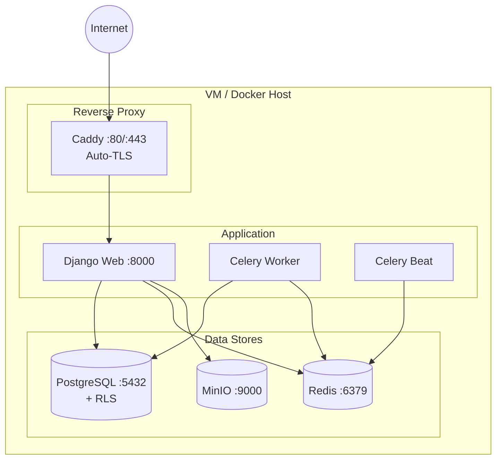

### Database Relationships

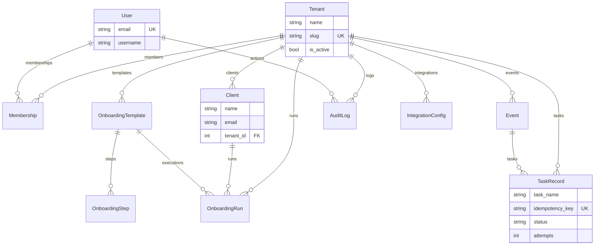

### Module Dependency Graph

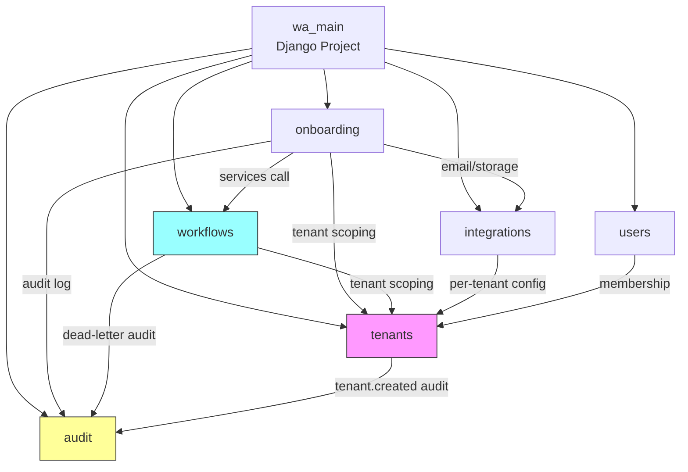

### Onboarding Sequence Diagram

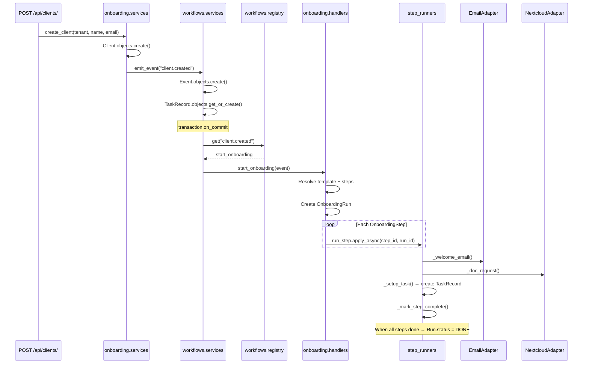

### Task Retry & Dead-Letter Flow

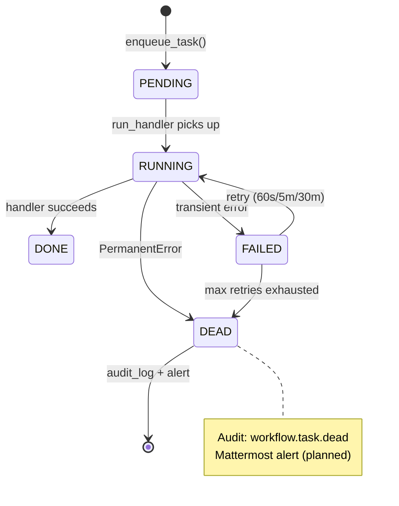

---

<div align="center">

Built with ❤️ using Django, Celery, and PostgreSQL

</div>
